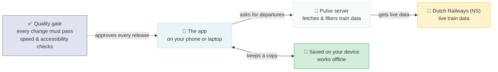
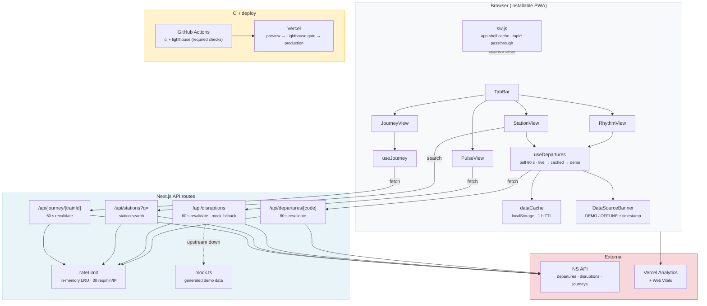

# Pulse

A transit companion for daily commuters on the Dutch rail network. Goes beyond departure times — surfaces network state, personal commute patterns, and per-carriage crowding.

Live at **[transit-blush.vercel.app](https://transit-blush.vercel.app)**

[](https://transit-blush.vercel.app)


---

## Features

- **Live departures** — real-time train data, refreshed every 60 seconds; falls back to demo data without an API key
- **Delay anomaly alerts** — compares upcoming trains to your 12-week personal baseline (Rhythm view)
- **Network disruptions** — live disruptions rendered as weather overlays (storm / fog / sun) on the map
- **Per-carriage crowding** — platform choreography showing which carriage is quietest and where to stand
- **Station search** — find any station by name or code; tap any departure to open its journey
- **Customisable display** — verbosity, crowding style (bars / dots / heatmap), and accent colour, all adjustable at runtime via the Tweaks panel; preferences persist to `localStorage`
- **Dark / light mode** — OKLCH token system, system-aware
- **Installable PWA with offline support** — app shell served by a custom service worker; last departures cached in `localStorage` (1 h TTL) and shown offline with an OFFLINE banner and data timestamp
- **Rate limiting** — 30 requests/minute per IP (in-memory, no external store needed)
- **Lighthouse deploy gate** — every Vercel preview is audited in CI; merge (and thus production deploy) is blocked unless Performance ≥ 90 and Accessibility / Best Practices / SEO = 100
- **Responsive** — mobile bottom tab bar, centered phone frame on tablet, sidebar layout on desktop

---

## Views

**Rhythm** — your personal commute. Next train hero card, delay anomaly alerts vs. your 12-week baseline, upcoming departures.

**Pulse** — live network map. Trains animate in real time, disruptions render as weather overlays (storm / fog / sun). Tap a train or station for detail.

**Journey** — per-train breakdown. Platform choreography (which carriage is quietest, where to stand), stop timeline with live delay updates.

**Station** — departure board for any station. Search by name or code, tap any departure to open its journey.

---

## Architecture

**How it works:** the app in your browser asks our own small server for train data. That server fetches it from the Dutch Railways (NS) and passes it on — your browser never talks to NS directly, and the server makes sure nobody can overload it. Everything you see is also saved on your device, so if you lose connection the app still opens and shows the last departures it saw, clearly marked as older data. Before any change goes live, an automatic quality check (Google Lighthouse) has to approve it — if the app would become slower or less accessible, the change simply can't ship.



### Under the hood



---

## Stack

| Layer | Technology |
|-------|-----------|
| Framework | [Next.js](https://nextjs.org) 16 (App Router) |
| UI | [React](https://react.dev) 19, SCSS Modules |
| Language | TypeScript 5 |
| Data | NS API — departures, stations, disruptions |
| Hosting | [Vercel](https://vercel.com) |
| Rate Limiting | In-memory LRU cache (30 req/min per IP) |
| Analytics | Vercel Analytics + Web Vitals |
| Offline | Service worker app shell + `localStorage` departures cache |
| Quality gate | Lighthouse CI on every Vercel preview (required check) |

---

## Getting started

```bash
npm install
npm run dev      # http://localhost:3000
npm test         # vitest
npm run build    # production build + type check
```

### Environment variables

| Variable | Required | Description |
|----------|----------|-------------|
| `NS_API` | No | API key. Without a key the app falls back to demo data; all views still work. |

---

## API routes

### `GET /api/departures/[code]`

Live departures for a station code (e.g. `ASD` for Amsterdam Centraal). Returns up to 15 departures with delay, track, and cancellation info. Cached for 60 seconds.

**Errors:**

| Status | Cause |
|--------|-------|
| `400` | Invalid station code format |
| `429` | Rate limit exceeded (30 req/min) |

### `GET /api/disruptions`

Active disruptions. Falls back to generated demo data if the upstream API is unavailable. Cached for 60 seconds.

**Errors:**

| Status | Cause |
|--------|-------|
| `429` | Rate limit exceeded (30 req/min) |

### `GET /api/stations?q=`

Station search (minimum 2 characters). Proxies the upstream station list.

**Errors:**

| Status | Cause |
|--------|-------|
| `429` | Rate limit exceeded (30 req/min) |

### `GET /api/journey/[trainId]`

Stop timeline for a train number (1–6 digits): planned vs. actual times, track, and crowd forecast per stop. Passing stops are filtered out. Cached for 60 seconds.

**Errors:**

| Status | Cause |
|--------|-------|
| `400` | Invalid train number format |
| `429` | Rate limit exceeded (30 req/min) |

---

## Project structure

```
app/
├── page.tsx                     Root page
├── layout.tsx                   Root layout — PWA, analytics, theme
├── globals.css                  OKLCH token system, light + dark themes
├── _components/
│   ├── TabBar.tsx               Bottom tab navigation
│   ├── TweaksPanel.tsx          Runtime display preferences
│   ├── views/                   Full-screen views: Rhythm, Pulse, Journey, Station
│   ├── shared/                  Reusable display components (DepartureRow, NowPill, CrowdingStrip, …)
│   ├── icons/                   SVG icon components
│   └── _partials/               Internal UI fragments (Loader, …)
├── _hooks/
│   ├── useDepartures.ts         Departures polling with live → cached → demo fallback
│   └── useJourney.ts            Journey detail data
├── _lib/
│   ├── rateLimit.ts             In-memory LRU rate limiter (30 req/min per IP)
│   ├── Analytics.tsx            Vercel Analytics wrapper
│   ├── RegisterSW.tsx           Service worker registration (production only)
│   └── WebVitals.tsx            Web Vitals reporting
├── _utils/
│   ├── api.tsx                  API client (getStationCodes)
│   ├── dataCache.ts             localStorage cache with TTL for offline departures
│   └── mock.ts                  Mock data generators for offline / keyless use
├── api/
│   ├── departures/[code]/       Live departures for a station
│   ├── disruptions/             Live disruptions, falls back to demo data
│   ├── journey/[trainId]/       Stop timeline for a train
│   └── stations/                Station search
└── interfaces/                  Shared TypeScript interfaces

public/
├── sw.js                        App-shell service worker (assets cache-first, navigations network-first)
├── manifest.json                PWA manifest
└── favicon/                     App icons (incl. maskable)
```

---

## Design

Tokens in `app/globals.css`. Key variables:

```
--bg / --bg-2 / --bg-3      background layers
--ink / --ink-2 / --ink-3   text hierarchy
--accent                    burnt orange — live indicators
--ok / --warn / --bad       on time / delayed / cancelled
```

Theme, verbosity, crowding style (bars / dots / heatmap), and accent colour are all adjustable at runtime via the Tweaks panel. Preferences persist to `localStorage`.

---

## Layout

- **Mobile** — bottom tab bar, full width
- **Tablet (441–767px)** — phone frame centered on page
- **Desktop (≥768px)** — 220px left sidebar, main content area up to 860px wide

---

## Project management

We use [Linear](https://linear.app) for issue tracking and planning. Team: **Product** (prefix: `PRO`).

Branches follow the format: `julianaijal/pro-{number}-{short-description}`

---

## Contributing

Contributions are welcome. Please open an issue first to discuss what you'd like to change.
